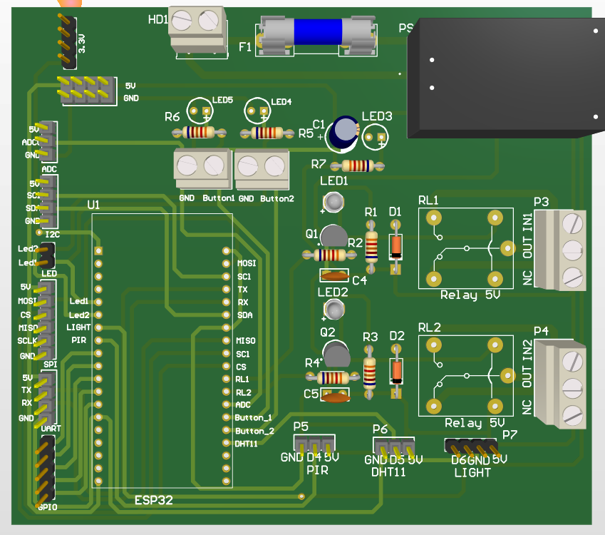
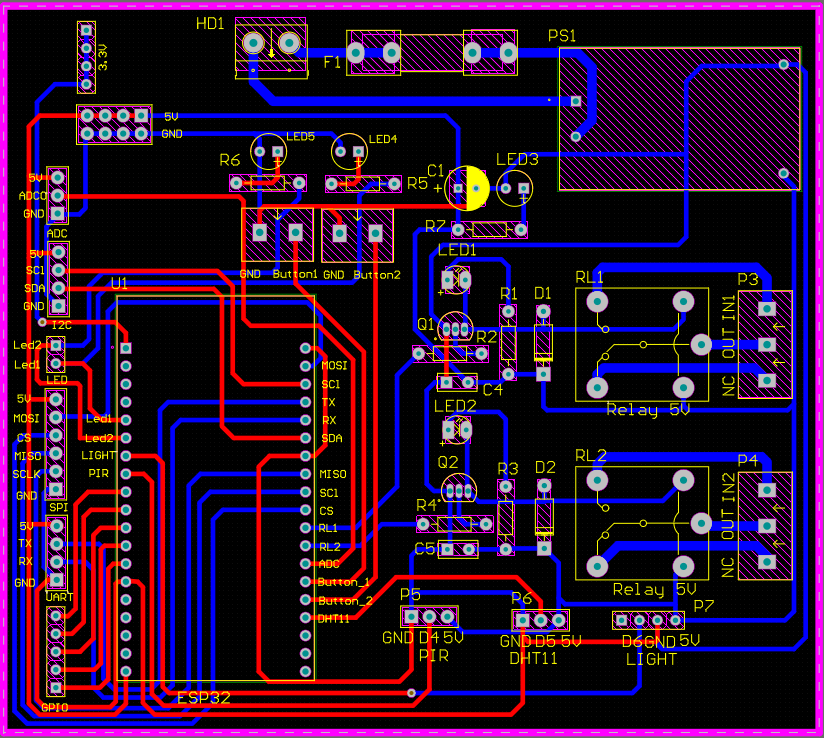
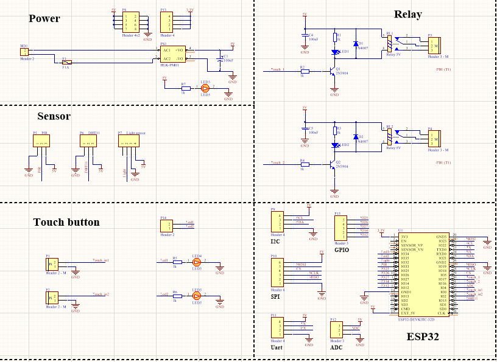

# Custom ESP32 Industrial Control Board

**Description:** Designed a 2-layer PCB using Altium Designer, integrating an ESP32 module with isolated 5V relay controls and dedicated communication headers (SPI, I2C, UART).

**Key Hardware Responsibilities:**
* [cite_start]Designed a 2-layer PCB using Altium Designer, focusing on logical system partitioning.
* [cite_start]Integrated an ESP32 module with isolated 5V relay controls to safely drive external loads.
* [cite_start]Routed dedicated and accessible communication headers for SPI, I2C, and UART protocols.
* Generated and managed comprehensive manufacturing outputs, including the Bill of Materials (BOM).

## Hardware Resources
* 📋 **Bill of Materials (BOM):** [View BOM File](BOM_ESP32_Control_Board.pdf)

## Project Images

| View | Image |
| :--- | :--- |
| **3D Board View** |  |
| **PCB Layout (Top & Bottom)** |  |
| **System Schematic** |  |
